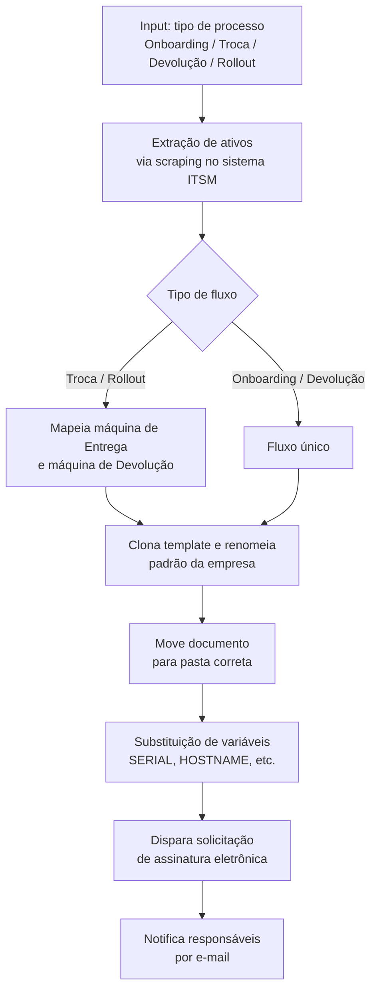

# 🤖 RPA — Automação de Termos de TI e Assinatura Eletrônica

Automação do ciclo de vida de hardware corporativo (entrega, troca, devolução e rollout), eliminando o preenchimento manual de documentos e a orquestração manual de assinaturas eletrônicas.

> **Nota de sanitização:** este repositório contém uma versão generalizada do projeto original. Nomes de sistemas, URLs, IDs de pasta e domínios de e-mail foram substituídos por placeholders. Nenhum dado real de empresa, colaborador ou credencial está presente neste código.

## 🎯 Problema de Negócio

A gestão do ciclo de vida de hardware de TI (entrega, substituição, devolução) dependia de esforço manual: extrair dados de ativos em um sistema ITSM, cruzar com a identidade do colaborador e preencher dezenas de campos em documentos estáticos antes de configurar manualmente a plataforma de assinatura eletrônica.

Dois cenários agravavam o problema:
- **Projetos de Rollout**, onde o vínculo entre máquina nova e colaborador ainda não existe no sistema.
- **Offboarding (desligamento)**, onde a devolução do ativo costuma ser conduzida por gestores ou RH — gerando falhas de rastreabilidade, perda de termos físicos e risco de compliance na recuperação do ativo.

## ✅ Solução

Robô de RPA em **Python + Selenium** que orquestra o fluxo de ponta a ponta: extrai os dados do ativo, gera o documento a partir de um template, substitui as variáveis dinamicamente e dispara a solicitação de assinatura eletrônica — reduzindo o tempo operacional de minutos para segundos por máquina, com zero digitação manual.

## 🧠 Estratégias Técnicas

- **Web Scraping via injeção de JavaScript:** extração de metadados do ativo direto do grid de dados da aplicação, contornando problemas de *Stale Element Reference* e lentidão de renderização.
- **Sessão persistente (user-data-dir):** reaproveitamento de uma sessão de navegador já autenticada entre execuções, eliminando reautenticações redundantes em execuções sequenciais no mesmo posto de trabalho.
- **Roteamento dinâmico de papéis:** o script ajusta automaticamente destinatário e testemunhas conforme o tipo de processo (ex.: em devoluções isoladas, substitui o e-mail do ex-colaborador pelo do responsável atual).
- **Manipulação de iframes (DOM):** controle de editores e pickers de arquivo embutidos via iframe para criar, renomear e mover documentos entre pastas.

## 🔄 Pipeline



## 🛠️ Stack

- Python 3
- Selenium WebDriver (Edge)
- Automação de interface web (DOM scripting via JS injection)

## ▶️ Como executar

```bash
pip install -r requirements.txt
python src/automacao_termos_ti.py
```

> Antes de rodar, configure as variáveis em `URL_SISTEMA`, `URL_TPL_*` e `PASTA_NUVEM_*` no início do script com os valores do seu próprio ambiente.

📊 Métricas

Tempo de execução: processo que levava em média ~8 a 10 minutos manuais por máquina passou a rodar em ~40 segundos, do início da extração até o disparo da assinatura.
Digitação manual: eliminação de praticamente 100% do preenchimento manual de campos nos documentos.
Padronização: nomenclatura de arquivos 100% consistente entre execuções, sem variação por digitação humana.
Rastreabilidade: cada termo gerado fica automaticamente organizado na pasta correta, pronto para auditoria.

> Números aproximados, baseados em observação do processo manual anterior — sem exposição de volumes reais de chamados ou dados da empresa.
